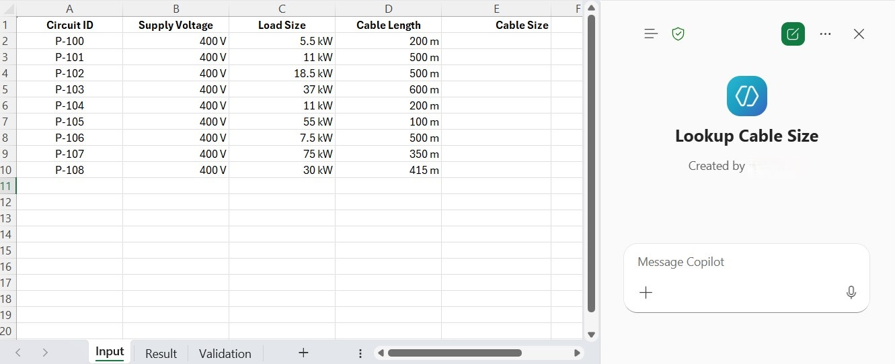
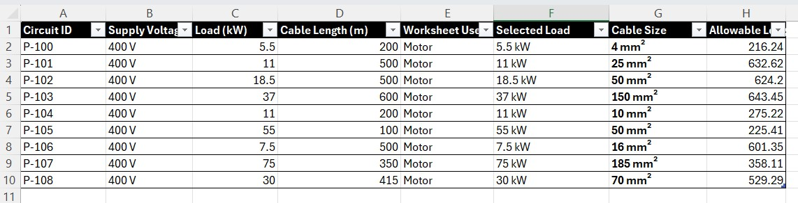
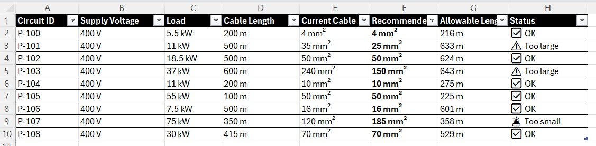
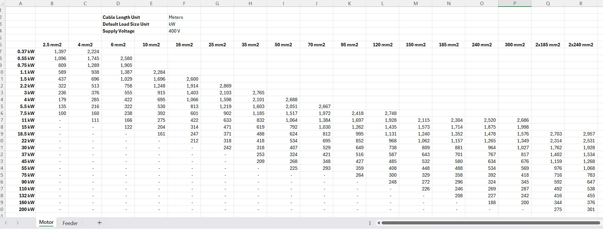

# Cable Size Lookup Declarative Agent

This is an example of an AI Agent that will use a given engineering "Voltage Drop Table" in an Excel file to lookup the smallest cable size suitable for a given circuit design. 

## Usage Example

Below is an example of how this Agent can be used within Excel.

### A. Given these sample circuits in an Excel worksheet.

### B. Ask the Agent to lookup the cable size

**Prompt**: Lookup the cable size for these circuits in worksheet "Input".

### C. Ask the Agent to validate the current cable size

**Prompt**: Validate the current cable size for these circuits in worksheet "Validation". Alert me if current cable is too small or too large.

# Build the Agent in Copilot

This Agent is built using the M365 Copilot Chat Desktop application. The main logic of this Agent is the Instruction Prompt. Below is the link to the prompt.

[Instruction Prompt for the Agent](Prompt/Cable_Size_Lookup_Prompt.md)

The process of building this prompt is an iterative process within Copilot itself. Below is some technique I used in this process.

- Tell Copilot that the result is incorrect and ask to show its logic so that you can refine your instruction prompt.
- Tell Copilot to improve the current instruction prompt to ensure the correct result.

## The Importance of Preparing Good Context Data

In this example, the context data is the configured "Voltage Drop Table" Excel file. Below is a sample of a lookup table for motor circuit.

A "Voltage Drop Table" workbook can contain multiple worksheets for variety of circuit designs. The original workbook has much more information and logic to generate these tables. Ideally, I want Copilot to use the original workbook to minimize the work process. However, it seems Copilot will attempt to incorporate these extraneous information into the lookup process.

The lookup process is a mechanical process that does not require any engineering logic. The basic steps are:

1. Scan the table and pick the equal or next larger load size.
2. Scan the length on the selected load row and pick the equal or next longer cable length.
3. Return the cable size which is the column header for the selected cable length cell.

This process can be applied to any similar lookup table.

### Prepare the Context Data

The final "Voltage Drop Table" Excel file has much of the extraneous data removed. Only information relevant to the lookup process are included. In addition, several Excel Name are defined for each lookup table:

- Load_Size
- Cable_Size
- Cable_Length

Also, all the blank cells on the left-bottom side of the table are populated with a value of zero. This help Copilot to count the correct column number.

# What is a Voltage Drop Table?

When designing a utilization circuit to feed an electrical load, several parameters must be considered when selecting the proper cable size for the given electrical circuit.

- The full load and/or starting current of the electrical load
- The impedance (dependent on length and size of cable) and ampacity of the electrical cable
- The maximum acceptable voltage drop (dependent of cable impedance) at the load terminal.
- The environment factors that may require cable ampacity to be derated for safe operation.

In a project, there might be hundreds or thousands of electrical circuits. One approach is to perform the cable sizing calculation for each of the circuits. Alternatively, we can generate a set of these voltage drop tables for various types of circuit so that a proper cable size can be determined quickly for each circuit.